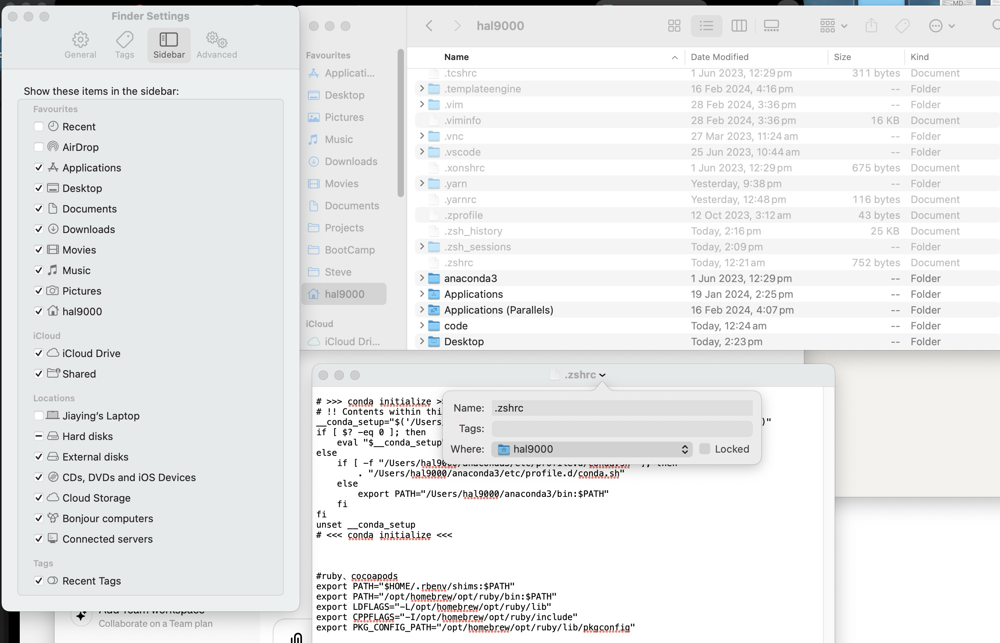

**install java**
https://www.openlogic.com/openjdk-downloads

**Install ruby (Mac)**
brew install rbenv ruby-build

rbenv install 3.2.2 
rbenv global 3.2.2

**show hidden folders**
defaults write com.apple.finder AppleShowAllFiles true

killall Finder

#ruby、cocoapods
export PATH="$HOME/.rbenv/shims:$PATH"  
export PATH="/opt/homebrew/opt/ruby/bin:$PATH"
export LDFLAGS="-L/opt/homebrew/opt/ruby/lib"
export CPPFLAGS="-I/opt/homebrew/opt/ruby/include"
export PKG_CONFIG_PATH="/opt/homebrew/opt/ruby/lib/pkgconfig"

**cocoapod**
brew install cocoapods

